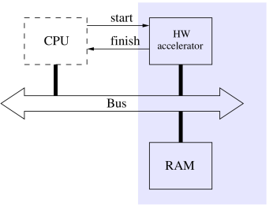
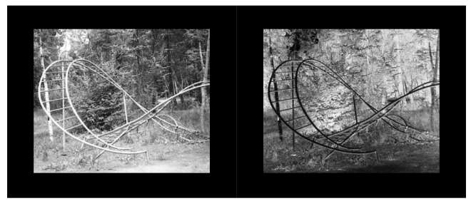
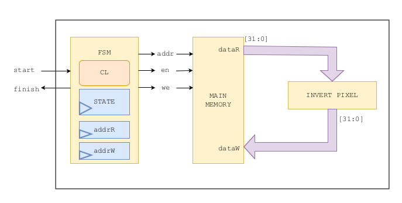
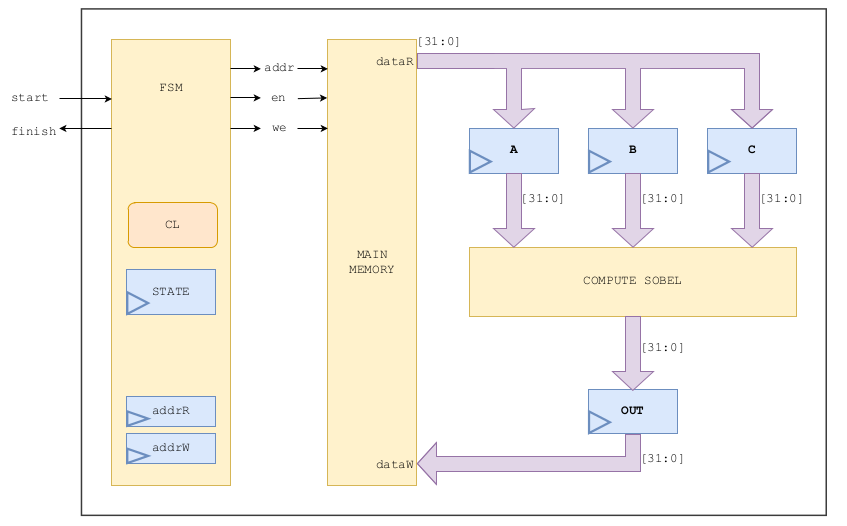
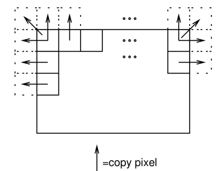
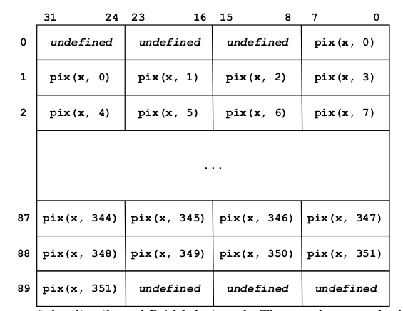
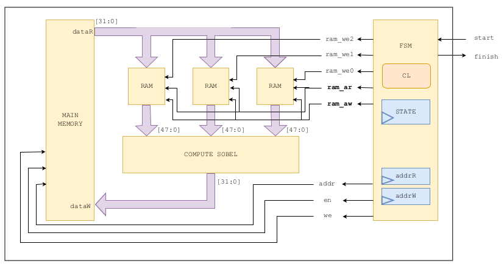
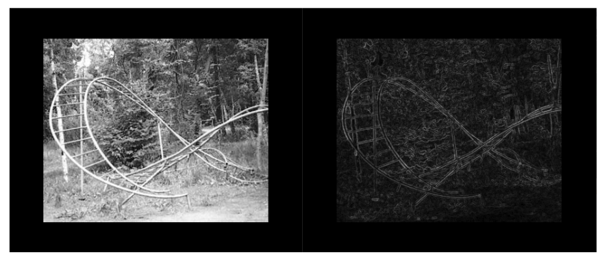

<!--
☜(⌒▽⌒)☞
<strong>☜(⌒▽⌒)☞</strong>
<strong>☜(⌒ᵕ⌒)☞</strong>
<strong>☜( ˊᵕˋ )☞</strong>
ଘ(੭*ˊᵕˋ)੭* ̀ˋ 
-->

<!-- PROJECT LOGO 
 

  
  -->

<h3 align="center">Edge Detector Hardware Accelerator :mag::mag:</h3>

  

    Final project of the <a href="https://lifelonglearning.dtu.dk/en/compute/single-course/design-of-digital-systems/">Design of Digital Systems</a> course, lectured at Technical University of Denmark, in the academic year of 2023/2024, as part of my MSc in Computer Science and Engineering.

  

<!-- TABLE OF CONTENTS -->

  
Table of Contents

  <ol>
    <li><a href="#introduction">Introduction</a></li>
    <li><a href="#whats_done">What's done</a></li>
    <li><a href="#whats_to_improve">What's to improve</a></li>
    <li><a href="#files_overview">Files Overview</a></li>
    <li><a href="#license">License</a></li>
    <li><a href="#acknowledgments">Acknowledgments</a></li>
  </ol>

<!-- ABOUT THE PROJECT -->
<!-- ## About The Project -->

<h2 id="introduction">Introduction</h2>
Edge detection is widely used in the image processing field. Essentially, this process works by analysing each images’ pixels, and detecting discontinuities in the brightness. Having only information about the edges, instead of the whole picture, allows for multiple diverse algorithms to process images quickly and efficiently. One of the best well-known applications for this technique is object detection.

### Goals
This project focused on the exploration of a hardware implementation in VHDL of the well-known edge detection technique called the **Sobel operator**. The piece of hardware designed should act as an accelerator. It should be able to receive a request signal from the CPU, and to access the memory, if it were to be implemented in a real-world scenario. This is depicted on the following picture, taken from the project guide.

The pictures to be analysed are black and white and have a fixed size of 352 by 288, in which each pixel is represented by an 8-bit value. These are stored in RAM memory, which needs to be accessed through reading and writing asynchronous operations. How the images are loaded from the computer to this memory is not part of the project scope.

(<a href="#readme-top">back to top</a>)

<h2 id="whats_done">What's done</h2>

To get familiarised with the project, students were challenged to develop the project in incremental steps, represented as **tasks** in the project guide. Each of these tasks correspond to one folder in this repository. All designs were implemented with VHDL and implemented in a FPGA. A full description of the project can be found on the project report.

### Task 0: getting familiar with a simpler project
The first task was to develop a hardware system that inverts the pixel of the image. The following figure shows the input and the output of such a system.

This was accomplished by the development of a state machine, as described in the following diagram.

The state diagram for the FSMD and ASMD-chart can be found on the report.

### Tasks 1, 2 & 3: first version of hardware edge detector
For the first draft of the real system, some assumptions were taken, to make the problem scope simpler:
- The edges of the images would not be processed correctly, instead, they would be set with 0
- The system would not cache a large amount of pixels for computing. No additional RAM entity would be used to cache data, only registers.

The following figure depicts a block diagram of the first version designed for this system.

The report contains detailed information on how the Sobel operator was used, and how data is loaded from memory, as well as an ASMD-chart. Furthermore, it discusses VHDL features that were used for the description of the system.

### Task 4: design optimization: computing edges & incorporating an additional RAM
The challenge for the next iteration was to reach a system which is able to correctly compute the boundary pixels, and that is also more efficient overall. A big goal was for us to explore the FPGA's memory resources.

#### Deal with edges
To deal with the boundary conditions, the technique chosen was the one described on the project guide: mirroring. This could be defined as expanding the original image by mirroring each one of the boundary pixels. In the end, the resulting image would be 354x290 pixels. When computing the Sobel operator on this new temporary image’s pixels, the processed image will be 352x288, which is the size of the original image. The following schema, taken from the project guide, depicts this technique.

#### Additional RAM
For this context, there are two RAM types that could make sense to use: **Distributed RAM** (also known as LUT RAM), and **Block RAM** (BRAM). The main characteristic that differentiates between the both options for this project is the fact that the LUT RAM supports **asynchronous reads** while BRAM only supports **synchronous reads**. In both cases, the write operation is synchronous. In this project, a distributed RAM was used. The main reason for this is that having asynchronous reads would make the circuit logic simpler to design.

Each RAM uses 32-bit words and can hold a total of 360 pixels, so that a complete row of the image can be stored. The following picture describes the data organisation inside the RAM.

The `x` represents a row on the original image. Using three instances of these RAMs, it is possible to compute 4 output pixels at the same time, maximizing efficiency, considering the interaction with the main memory. Each one of these 3 RAMs will correspond to a row of the image.

A block diagram of the system with the RAMs implemented is shown on the following image.

### Results

Using one of the example images that were provided in the project, the following results were obtained.

The pixels on the resulting image will not be on a scale from 0 to 255 because of truncation, and that's why it looks a bit darker.

All the designs were correctly synthesized and implemented on the FPGA.

(<a href="#readme-top">back to top</a>)

<h2 id="whats_to_improve">What's to improve</h2>
Even though the goals for this project were achieved and even exceeded, there are quite a lot of things that could be improved. 

- A mapping function should have been used on the output of the Sobel operator. Because the results were truncated, then the resulting image does not have pixels in the range of 0 to 255, and therefore the image will look darker than it should.

- The `rem` operator was used in VHDL, which is a computiation based on multiplication and subtraction - which can never achieve a good performance on hardware. The report describes an analysis on the use of this operator. The conclusion is that it should be replced by an alternative. Two of them come to mind: implementing a lookup table using LUTs; or using registers as counting variables, which would work for the same goal.

- No testbenches were implemented in the scope of the project. Instead, the results were validated with a Python script implemented for this purpose. Python was chosen for the development speed.

These things would be interesting improvements but couldn't be implemented due to the limited time and scope of the project, which characterizes any academic project.

(<a href="#readme-top">back to top</a>)

<!-- ROADMAP -->
<h2 id="files_overview">Directories/Files Overview</h2>
<!-- 
The branch <a href="https://github.com/immarianaas/cd-message-broker/tree/original">`original`</a> is where an unaltered version of the project will be placed. If one day this code is to be improved, that branch will remain the same.
-->

| directory/file                         | description                                                                                |
| ----------------------------- | ------------------------------------------------------------------------------------------- |
| `report.pdf` | Report of the project where all of this information and more is explained |
| `guide.pdf` | Project guide provided by the professor |
| `mid-presentation.pdf` | Slides used in a presentation that occured halfway through the project development |
| `inverter-0/` | Project code related to the task 0 |
| `inverter-board/` | Project code related to the task 0 modified to be implemented in the FPGA |
| `edge-detector-2/` | Project code related to the task 2 |
| `improved-edge-detector-4/` | Project code related to the task 4 |
| `improved-edge-detector-board/` | Project code related to the task 4 modified to be implemented in the FPGA |
| `images/` | Images used in this document |

(<a href="#readme-top">back to top</a>)

<!-- LICENSE -->
<h2 id="license">License</h2>

Distributed under the MIT License. See `LICENSE` for more information.

(<a href="#readme-top">back to top</a>)

<!-- ACKNOWLEDGMENTS -->
<h2 id="acknowledgments">Acknowledgments</h2>

[DTU - Danmarks Tekniske Universitet](https://www.dtu.dk/)

(<a href="#readme-top">back to top</a>)

<!-- MARKDOWN LINKS & IMAGES -->
<!-- https://www.markdownguide.org/basic-syntax/#reference-style-links -->

[forks-shield]: https://img.shields.io/github/forks/immarianaas/cd-message-broker.svg?style=for-the-badge
[forks-url]: https://github.com/immarianaas/cd-message-broker/network/members

[stars-shield]: https://img.shields.io/github/stars/immarianaas/cd-message-broker.svg?style=for-the-badge
[stars-url]: https://github.com/immarianaas/cd-message-broker/stargazers

[issues-shield]: https://img.shields.io/github/issues/immarianaas/cd-message-broker.svg?style=for-the-badge
[issues-url]: https://github.com/immarianaas/cd-message-broker/issues

[license-shield]: https://img.shields.io/github/license/immarianaas/cd-message-broker.svg?style=for-the-badge
[license-url]: https://github.com/immarianaas/cd-message-broker/blob/master/LICENSE

<!--
[linkedin-shield]: https://img.shields.io/badge/-LinkedIn-black.svg?style=for-the-badge&logo=linkedin&colorB=555
[linkedin-url]: https://linkedin.com/in/linkedin_username
-->

[product-screenshot]: images/screenshot.png
[Next.js]: https://img.shields.io/badge/next.js-000000?style=for-the-badge&logo=nextdotjs&logoColor=white
[Next-url]: https://nextjs.org/
[React.js]: https://img.shields.io/badge/React-20232A?style=for-the-badge&logo=react&logoColor=61DAFB
[React-url]: https://reactjs.org/
[Vue.js]: https://img.shields.io/badge/Vue.js-35495E?style=for-the-badge&logo=vuedotjs&logoColor=4FC08D
[Vue-url]: https://vuejs.org/
[Angular.io]: https://img.shields.io/badge/Angular-DD0031?style=for-the-badge&logo=angular&logoColor=white
[Angular-url]: https://angular.io/
[Svelte.dev]: https://img.shields.io/badge/Svelte-4A4A55?style=for-the-badge&logo=svelte&logoColor=FF3E00
[Svelte-url]: https://svelte.dev/
[Laravel.com]: https://img.shields.io/badge/Laravel-FF2D20?style=for-the-badge&logo=laravel&logoColor=white
[Laravel-url]: https://laravel.com
[Bootstrap.com]: https://img.shields.io/badge/Bootstrap-563D7C?style=for-the-badge&logo=bootstrap&logoColor=white
[Bootstrap-url]: https://getbootstrap.com
[JQuery.com]: https://img.shields.io/badge/jQuery-0769AD?style=for-the-badge&logo=jquery&logoColor=white
[JQuery-url]: https://jquery.com 

[mariana-github-shield1]: https://img.shields.io/badge/--black.svg?style=for-the-badge&logo=github&colorB=555
[mariana-linkedin-shield1]: https://img.shields.io/badge/--black.svg?style=for-the-badge&logo=linkedin&colorB=0e76a8

[mariana-github-shield]: https://img.shields.io/badge/-Mariana-black.svg?style=for-the-badge&logo=github&colorB=555
[mariana-linkedin-shield]: https://img.shields.io/badge/-Mariana-black.svg?style=for-the-badge&logo=linkedin&colorB=555

[mariana-github-url]: https://github.com/immarianaas
[mariana-linkedin-url]: https://www.linkedin.com/in/immarianaas

[miguel-github-shield1]: https://img.shields.io/badge/--black.svg?style=for-the-badge&logo=github&colorB=555
[miguel-linkedin-shield1]: https://img.shields.io/badge/--black.svg?style=for-the-badge&logo=linkedin&colorB=0e76a8

[miguel-github-shield]: https://img.shields.io/badge/-Miguel-black.svg?style=for-the-badge&logo=github&colorB=555
[miguel-linkedin-shield]: https://img.shields.io/badge/-Miguel-black.svg?style=for-the-badge&logo=linkedin&colorB=555

[miguel-github-url]: https://github.com/Miguel17297
[miguel-linkedin-url]: https://github.com/immarianaas/cd-message-broker

[Python-logo]: https://img.shields.io/badge/Python-306998?style=for-the-badge&amp;logo=python&amp;logoColor=white
[Python-url]: https://python.org